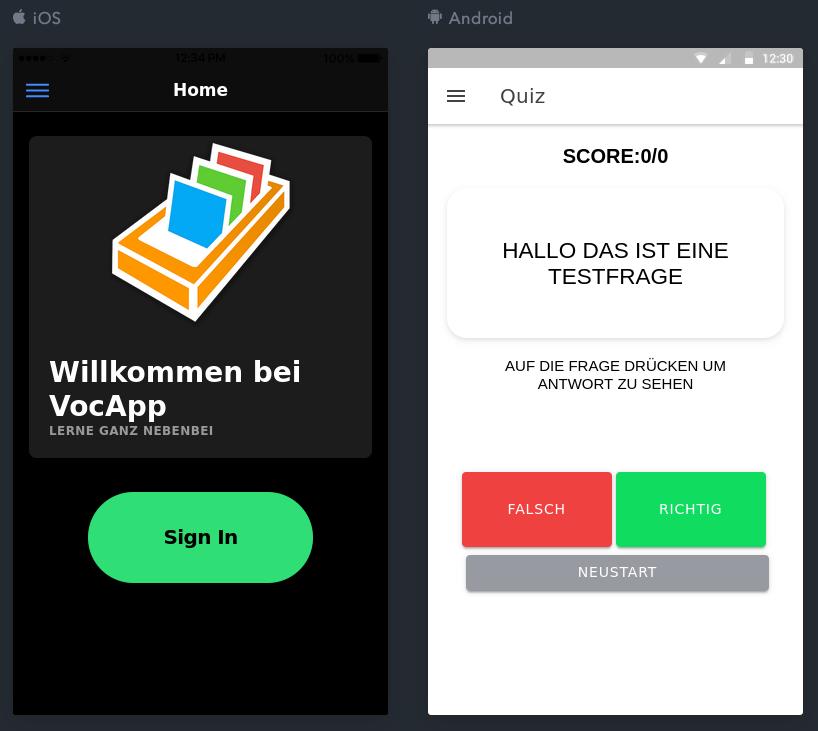

# VocApp


Unsere App soll helfen das Lernen von Sprachen sowie das Lernen für Test besser und einfacher in den Alltag zu integrieren. Mit Fragen die aufscheinen wenn man das Handy entsperren will und bei ausgewählten Apps soll dieses Ziel erreicht werden.



Hackdash: https://hackdash.org/projects/5db569b28f5583072ba59000

## Installation

Node installieren (https://nodejs.org)

Danach kann man `npm` im Terminal verwenden

Ionic global installieren:

```
npm install -g ionic
```

Danach kann man im Terminal den Befehl `ionic` verwenden

In der PowerShell muss man zusätzlich noch

```
Set-ExecutionPolicy -Scope CurrentUser -ExecutionPolicy Unrestricted
```

eingeben

Repo klonen

Ins Projektverzeichnis wechseln und die Pakete installieren:

```
npm install
```

Dann Ionic-Lab starten:

```
ionic serve --lab
```
